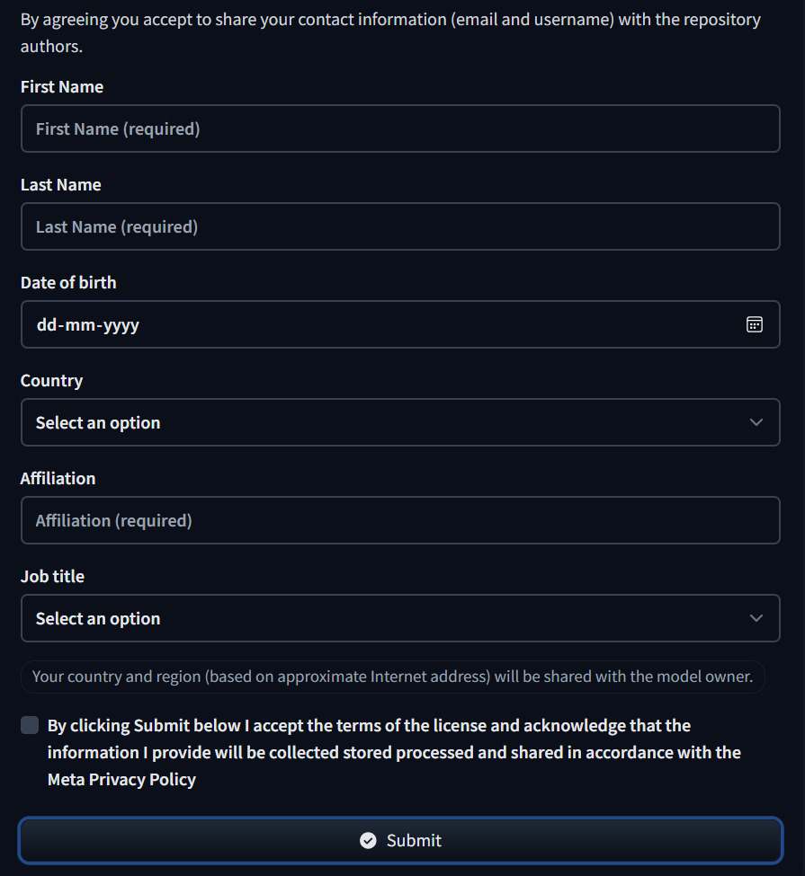

<h1 align="center">
  Trigger Recognition for Enjoyable and Appropriate Television
</h1>

<p align="center">


</p>

I was tired of getting grossed out watching unexpected scenes in movies and TV and losing my appetite, that's why I created TREAT.

The goal of this project is to empower viewers by forewarning them about potential triggers in the content they watch, making the viewing experience more enjoyable, inclusive, and appropriate for everyone.

TREAT is a web application that uses natural language processing to analyze movie and TV show scripts, identifying potential triggers to help viewers make informed choices.

## Installation Instructions
### Prerequisites
 - Star the Repository to Show Your Support.
 - Clone the Repository to Your Local Machine:

    ```bash
   git clone https://github.com/Kuberwastaken/TREAT.git
    ```

### Hugging Face Login Instructions for Llama-3.2-1B Model
To use the [Llama-3.2-1B model](https://huggingface.co/meta-llama/Llama-3.2-1B), which provides a 35% increase in accuracy and efficiency over the [previous model](https://github.com/Kuberwastaken/TREAT-CS50), you must request access for it, as it is a gated model.

   

1. **Login to Hugging Face in Your Environment:**

    Run the following command in your terminal:

    ```bash
    huggingface-cli login
    ```

    Enter your Hugging Face access token when prompted.

2. **Download the Llama-3.2-1B Model:**

   The model will be downloaded automatically when running the script analysis for the first time, provided you have received access.

### Environment Setup
To set up the development environment, you will need to create a virtual environment and install the necessary dependencies.

1. Create a Virtual Environment:

   ```bash
   python3 -m venv treat-env
   ```

2. Activate the Virtual Environment:

   ```bash
   source treat-env/bin/activate   # On Unix or MacOS
   treat-env\Scriptsctivate      # On Windows
   ```

3. Install Dependencies:

   Navigate to the project directory and run:

   ```bash
   pip install -r requirements.txt
   ```

## Project Usage
1. **Start the Flask Server:**

   ```bash
   python run.py
   ```

2. **Open Your Browser:** 

   Navigate to `http://127.0.0.1:5000` to access the TREAT web interface.

3. **Analyze Scripts:**

   You can manually enter a script in the provided text area and click "Analyze Script."

## File Descriptions
- **app.py:** The main Flask application file that handles routing.

- **app/routes.py:** Contains the Flask routes for handling script uploads.

- **app/model.py:** Includes the script analysis functions using the Llama-3.2-1B model.

- **templates/index.html:** The main HTML file for the web interface.

- **static/css/style.css:** Custom CSS for styling the web interface.

- **static/js/app.js:** JavaScript for handling client-side interactions.

## Types of Triggers Detected
The TREAT application focuses on identifying a variety of potential triggers in scripts, including but not limited to:

- **Violence:** Scenes of physical aggression or harm.

- **Self-Harm:** Depictions of self-inflicted injury.

- **Death:** Depictions of death or dying characters.

- **Sexual Content:** Any depiction or mention of sexual activity, intimacy, or behavior.

- **Sexual Abuse:** Instances of sexual violence or exploitation.

- **Gun Use:** Depictions of firearms and their usage.

- **Gore:** Graphic depiction of injury, blood, or dismemberment.

- **Vomit:** Depictions of vomiting or nausea-inducing content.

- **Mental Health Issues:** Depictions of mental health struggles, including anxiety, depression, or disorders.

- **Animal Cruelty:** Depictions of harm or abuse towards animals.

These categories help address a very real-world problem by forewarning viewers about potentially distressing content, enhancing their viewing experience.

Adding new categories is as simple as specifying a new category under model.py and utils.py

## Design Choices

- **Inspiration:** I aimed for a simple and intuitive user experience, focusing on simplicity and ease of use. This decision stemmed from the need to create a tool that is easy to navigate for all users, regardless of background or age.

- **Theme and Color Scheme:** The chosen theme and color scheme create a visually appealing and engaging environment. The chocolate and sweets theme is intended to stick to the TREAT theme and make the experience enjoyable and pleasant.

- **Script Analysis:** The Llama-3.2-1B model by Meta was chosen for its increased accuracy (about 35% better) compared to the prior FLAN-T5 version. The decision was based on its ability to provide precise trigger recognition while being open source. As a new and advanced model, it enhances the script analysis capabilities significantly.

## How to Edit Sensitivity Settings or Prompts

To adjust the sensitivity or modify the prompts used during script analysis, you can edit the `model.py` file located under the `treat/app` directory. This file contains various parameters and settings that control how triggers are identified and how the model processes the script. Here’s how you can adjust key settings:

### Key Parameters to Edit:


   - **max_new_tokens**: Controls the maximum number of tokens (words or characters) the model will generate in response to a prompt. A higher number can lead to more detailed results but may also increase processing time.

   - **temperature**: Controls the randomness of the model's responses. A value of 1.0 means standard behavior, while lower values (e.g., 0.2) make the model's output more deterministic and focused. Higher values (e.g., 1.5) allow for more creative or varied responses.

   - **top_p** (Nucleus Sampling): Controls how many of the top predicted tokens are considered during text generation. A value of 0.9 means the model will only consider the top 90% of predictions, cutting off the least likely options. A lower value can make the output more coherent but less creative.

   To adjust these, look for `max_new_tokens`, `temperature`, and `top_p` in the `model.py` file and set them to your desired values. For example:
   ```python
   max_new_tokens = 10  # Set the maximum number of tokens
   temperature = 0.7  # A moderate level for balanced responses
   top_p = 0.9  # Adjust the diversity of the output
   ```

### Chunk Size and Overlap:
To handle long scripts effectively, the text is divided into chunks before being analyzed. Adjusting the chunk size and overlap helps control how much of the script is processed at once and ensures that the model doesn't miss context between chunks.

- **chunk_size**: This parameter defines the length of each chunk in tokens. A larger chunk size can help the model capture more context, but may result in higher memory usage and processing time. A smaller chunk size may process faster but could lose context.
  
- **overlap**: This parameter defines the number of overlapping tokens between consecutive chunks. Adding overlap ensures that context from the end of one chunk is carried over to the next chunk, preventing the model from losing important information.

   To adjust these, look for `chunk_size` and `overlap` in `model.py` and set them to your desired values:
   ```python
   chunk_size = 1000  # Set the length of each chunk (tokens)
   overlap = 200  # Set the number of overlapping tokens between chunks
   ```

### Adjusting Prompts:
To modify the types of triggers detected by the model, you can edit the prompts under the `trigger_categories` section in `model.py`. This section allows you to adjust how the model recognizes various types of content in the script. Simply modify the prompts to suit your needs.

### Summary of Editable Parameters:
- **max_new_tokens, temperature, top_p**: Control the length, randomness, and diversity of the model's output.
- **chunk_size, overlap**: Control how the script is divided into chunks and how context is maintained between chunks.
- **trigger_categories**: Adjust the prompts to change how triggers are identified in the script.


## To-Do List
- Integration with an API to Directly Search Scripts by Name of Movies/Shows

- Introduce multiple themes to allow users to customize the appearance of the application according to their preferences

- Increasing speed and efficiency

- Potentially host this online

- Make the application mobile-friendly

## Open Source Contribution
This repository is completely open source and free to contribute. I intend to keep this project alive and evolve it into a tool that's extremely usable for all. Contributions are welcome and highly encouraged to add new features, improve the user interface, or enhance the script analysis.

## Acknowledgements
I would like to thank:

- Meta AI: For developing and allowing me access to the Llama-3.2-1B model, a very critical component of this project.

- Parasite (2019): For that unexpected jumpscare that ruined my appetite and ultimately inspired this project.

## License
This project is licensed under the [Apache 2.0 License](https://github.com/Kuberwastaken/TREAT/blob/main/LICENSE).
